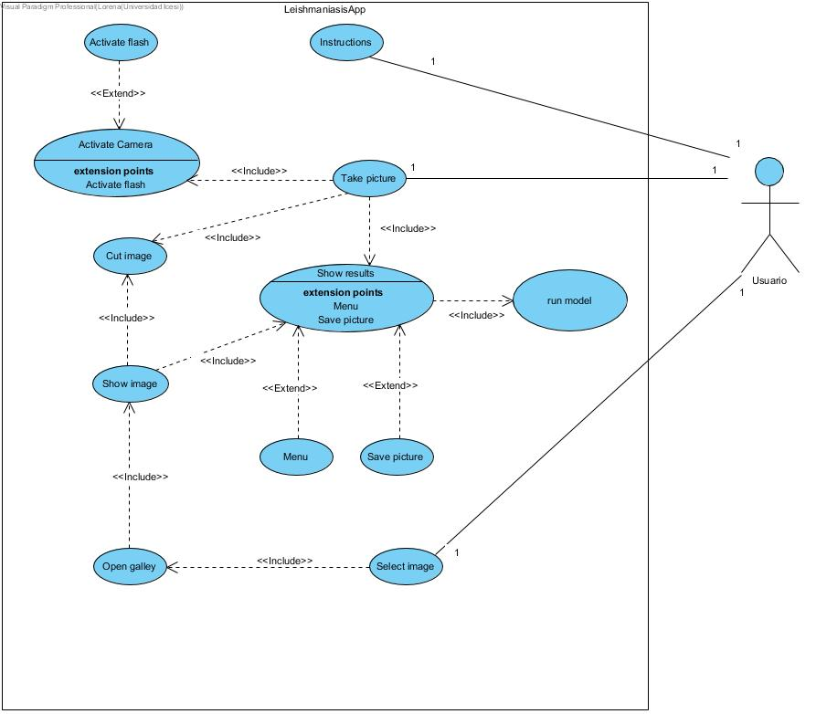
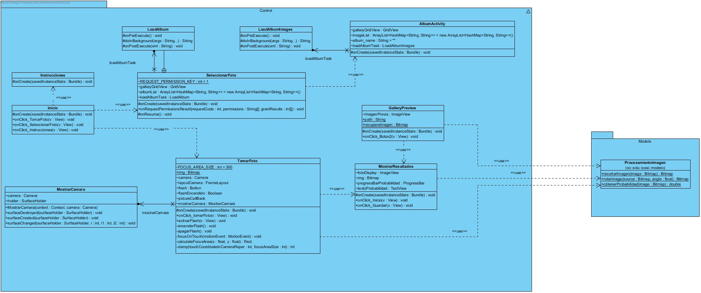
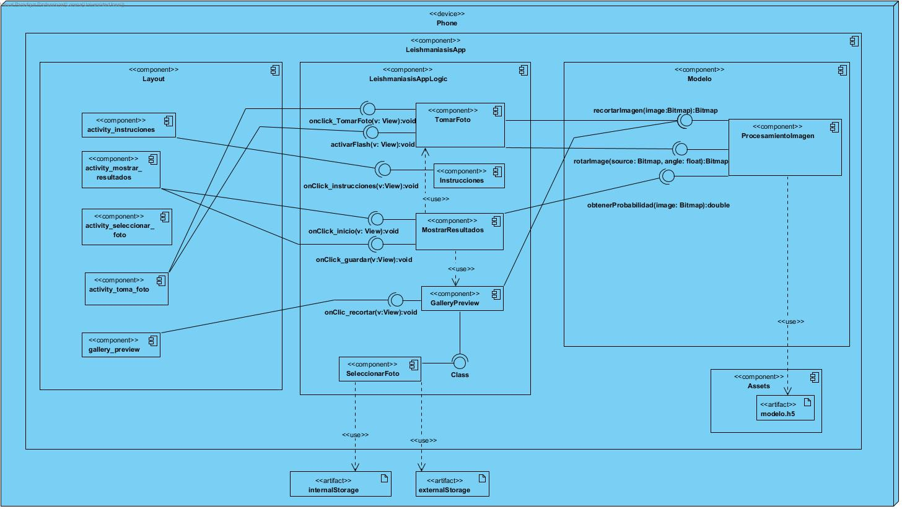
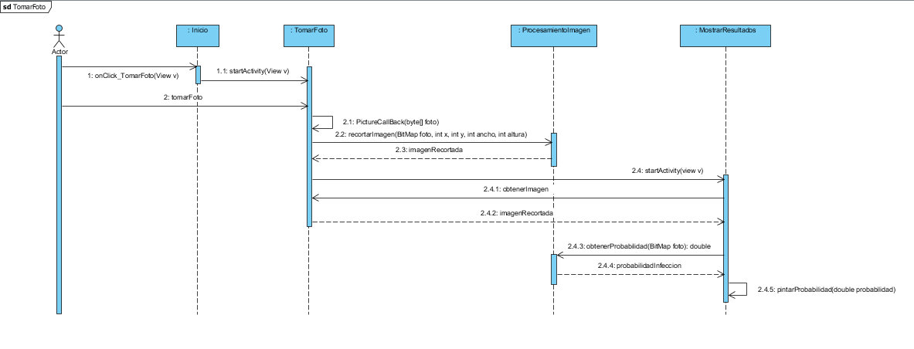
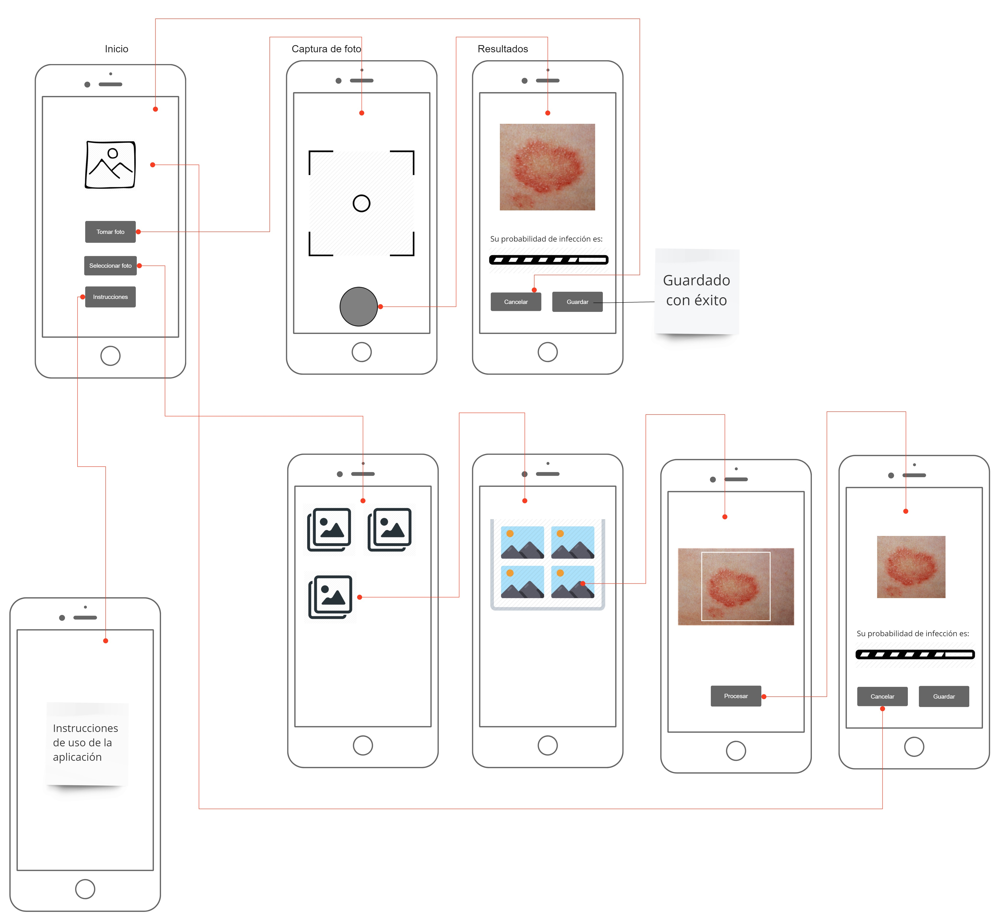

# Aplicación Movil

## Elicitación de requerimientos

Se debe construir una aplicación móvil que esté disponible en Android y que no requiera  de acceso a la red para su funcionamiento.

Al abrir la aplicación se debe mostrar un menú inicial que muestre las principales funcionalidades de la aplicación. En este punto el usuario debe tener la opción de cargar una foto desde la galería de fotos o abrir la cámara para tomar una foto nueva. Adicionalmente una seccion donde se indiquen las instruciones de uso.

Posteriormente, tras haber cargado la foto o haber tomado una foto con la cámara, se debe permitir al usuario realizar un recorte cuadrado de la imagen. Para esto el usuario podra ajustar la imagen en el recuadro que se dibujara en pantalla. El recorte debe tener igual ancho y altura.

Una vez que se hace el recorte  de la imagen inmediatamente se debe evaluar la imagen con el modelo de pre diagnóstico de leishmaniasis cutánea. El modelo de pre diagnóstico debe ser construido utilizado técnicas de machine learning.

Una vez evaluada la imagen se mostrará al usuario el resultado arrojado por el modelo predictivo, donde se pre-diagnóstica si la lesión efectivamente tiene gran posibilidad de ser producto de la leishmaniasis. En este punto si el usuario lo desea debe poder guardar los resultados como una imagen, mostrando tanto el recorte como los valores arrojados por el modelo predictivo o también podrá cancelar proceso y volver al menú inicial.

## Especificación de requerimientos

### Requerimientos funcionales

**R-F1.** Al entrar en la aplicación se debe mostrar un menú de inicio, con las principales funcionalidades de la aplicación, como: tomar foto, seleccionar foto de la galería y instrucciones de uso.

**R-F2.** La aplicación debe tener una guía de uso para el usuario, donde explique claramente las instrucciones de navegación en la aplicación.

**R-F3.** La aplicación debe permitir abrir una foto seleccionandola y cargándola desde la galería de fotos del teléfono.

**R-F4.** La aplicaciòn debe permitir abrir una foto habilitando la cámara del teléfono para capturarla.

**R-F5.** Cuando se visualice una foto, la aplicación debe permitir recortar la imagen, donde el usuario podra ajustar la imagen al cuadrado que se dibujara en la pantalla, obteniendo como resultado un recorte cuadrado de la imagen; el tamaño debe ser el mismo en ancho y altura. 

**R-F6** Una vez se recorte la imagen se debe realizar el pre diagnóstico a partir del modelo.

**R-F7.** Si el usuario realiza el prediagnóstico de la imagen se debe mostrar en pantalla tanto el recorte de la imagen como la probabilidad de que tenga leishmaniasis cutánea.

**R-F8.** Después de mostrar en pantalla la probabilidad de que el recorte contenga una imagen producto de leishmaniasis cutánea, el usuario debe poder guardar los resultados como una imagen, incluyendo tanto el recorte como la probabilidad.

**R-F9.**  La aplicación debe permitir cancelar la acción y volver al menú de inicio  en todo momento.

### Requerimientos no funcionales

**R-NF1.** La aplicación debe estar disponible para dispositivos Android.

**R-NF2.** La aplicación debe funcionar sin acceso a la red.

**R-NF3.** El modelo predictivo debe ser construido haciendo uso de técnicas de machine learning.

## Diseño

**Caso de uso**

**Diagrama de clases**

**Deployment**

**Diagrama de secuencia**

**Wireframe**

                                                           
                                                       

